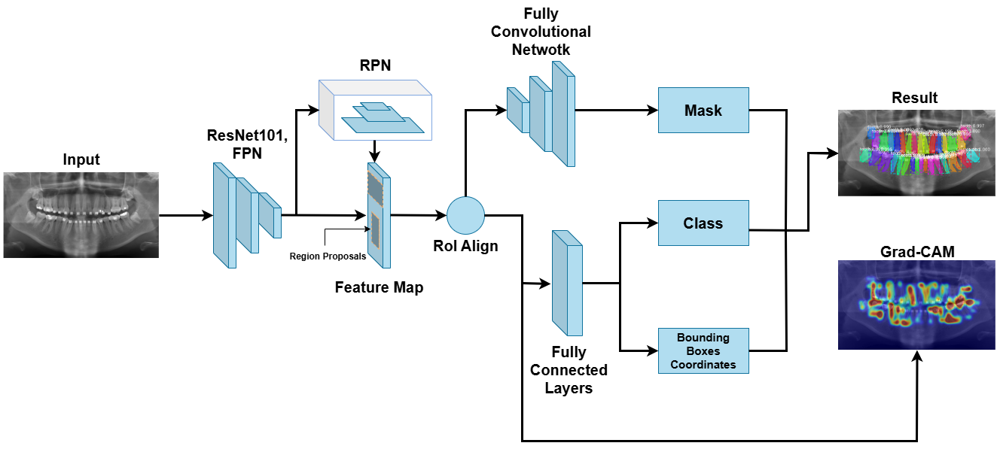
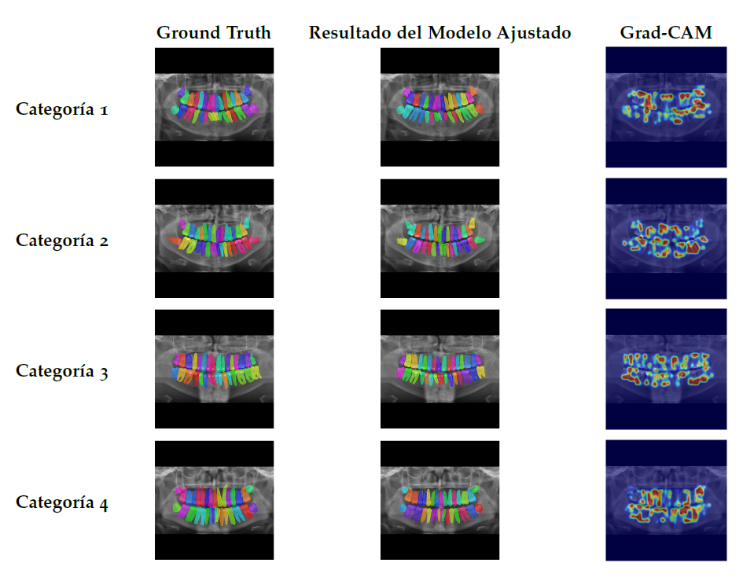
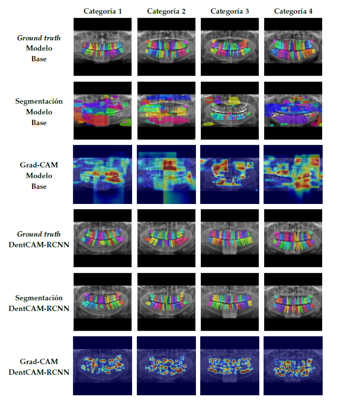
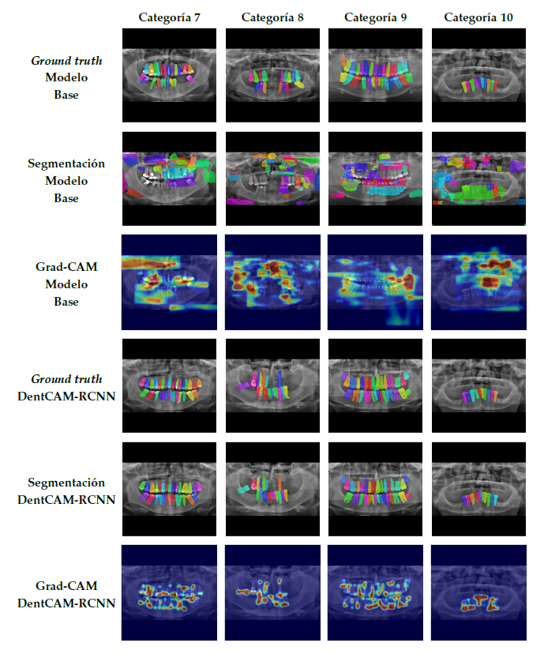

# 🦷 DentCAM-RCNN - Código del Trabajo de Fin de Grado

## 1. 🎓 Introducción

Este repositorio contiene el código y resultados de la parte informática de mi Trabajo de Fin de Grado (TFG), centrado en la segmentación y explicabilidad de piezas dentales en ortopantomografías mediante el uso de redes neuronales profundas. El modelo utilizado se basa en **Mask R-CNN** e incorpora un módulo de explicabilidad mediante **Grad-CAM**.

---

## 2. 🧠 Sobre DentCAM-RCNN

**DentCAM-RCNN** es una versión adaptada de Mask R-CNN entrenada sobre radiografías panorámicas dentales. Su objetivo es segmentar individualmente cada pieza dental y, a través de Grad-CAM, proporcionar mapas de atención visual que ayuden a comprender las decisiones del modelo.

---

## 3. 🖼️ Arquitectura del Modelo

<div align="center">
  
</div>

La arquitectura está basada en una red **ResNet101 con FPN**, seguida de una red de propuestas de región (RPN), alineamiento RoI, y ramas para clasificación, regresión de cajas y segmentación. Grad-CAM se aplica sobre los logits antes del softmax de la clasificación por instancia.

---

## 4. 🔍 Grad-CAM y Explicabilidad

<div align="center">
  
</div>

Se ha implementado Grad-CAM sobre la capa `roi_align_classifier` para generar mapas de calor específicos por instancia. Esto permite identificar qué zonas han influido más en la predicción de cada diente.

---

## 5. 🧪 Comparativa Visual de Resultados

A continuación se muestran ejemplos comparativos entre el modelo base y DentCAM-RCNN, incluyendo la segmentación y los mapas de atención generados:

### Categorías 1 a 4

<div align="center">
  
</div>

### Categorías 7 a 10

<div align="center">
  
</div>

---

## 6. 🗂️ Estructura del Repositorio

```text
DentCAM_RCNN/
├── dataset/               # Conjunto de datos utilizados
├── img/                   # Imágenes utilizadas en el README
├── mrcnn/                 # Código fuente del modelo Mask R-CNN
├── dentcam_rcnn.ipynb     # Notebook principal con todo el flujo de trabajo
├── requirements.txt       # Dependencias del proyecto
├── LICENSE
└── README.md
```
---

## 7. ⚙️ Instalación y Ejecución

### 1️⃣ Clona el repositorio:

```bash
git clone https://github.com/juanmaarg6/DentCAM_RCNN.git
cd DentCAM_RCNN
```

### 2️⃣ Instala las dependencias:

```bash
pip install -r requirements.txt
```

🔧 Se recomienda utilizar un entorno virtual (por ejemplo, con venv o conda) para evitar conflictos de versiones.

### 3️⃣ Ejecuta el notebook:

Abre `dentcam_rcnn.ipynb` con Jupyter Notebook o JupyterLab para reproducir el entrenamiento, la segmentación y la generación de mapas Grad-CAM.

🎯 ¡Gracias por visitar el repositorio! Cualquier duda, comentario o sugerencia es bienvenida.
